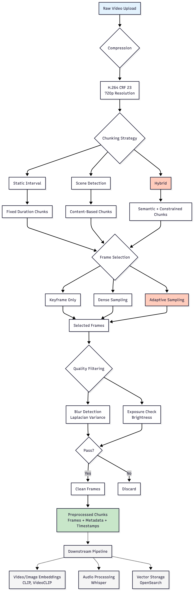

# Video Preprocessing: The Foundation of Semantic Search

You're a video editor with 200 files of raw footage. You need that exact 3-second clip where someone opens the fridge. Clicking through files manually? That's your whole afternoon gone.

We're building **ClipABit**, a semantic search engine that integrates directly with video editors. Upload your footage, query with natural language ("show me fridge scenes"), get results in seconds. But before any embeddings or cross-attention happens, there's a massive preprocessing problem:

> **1080p @ 30fps = 100 MB/minute**

A typical editor's project folder: 50+ hours of footage = 300 GB. You can't embed every frame (that's 5.4 million frames), you can't store them all, and half are blurry B-roll anyway.

**Preprocessing solves this!** No transformers, no attention mechanisms, but it's what makes the semantic search engine actually work.

---
## The Three Problems We Solve

### Chunking: Where do moments start and end?

Video is continuous. Search needs discrete chunks. How do you split "cooking dinner" from "eating dinner"?

**Approaches tried:**

- **Static chunking** (every 10 seconds): Simple but dumb. Splits activities mid-action. Your "pouring coffee" search hits two chunks: "pour—" and "—ing coffee."
- **Scene detection** (`PySceneDetect`): Uses histogram differences between consecutive frames to detect cuts. Works great for semantically meaningful boundaries but unpredictable; you get 2-second chunks and 60-second chunks. Critical for aligning chunks with actual content changes [[1]](#references).
- **Hybrid** (scene detection + constraints): **Our winner.** Detect scene changes but enforce 5–20 second limits. Semantic boundaries without chaos.

```python
def chunk_hybrid(video_path, min_duration=5, max_duration=20):
    # Detect scenes using histogram differences
    scenes = detect(video_path, ContentDetector(threshold=25))
    chunks = []

    for scene in scenes:
        duration = scene[1].get_seconds() - scene[0].get_seconds()

        if duration < min_duration:
            # Merge with next scene (prevent tiny chunks)
            merge_with_next(scene)
        elif duration > max_duration:
            # Split into fixed intervals (prevent huge chunks)
            split_scene(scene, max_duration)
        else:
            chunks.append(scene)  # Just right

    return chunks
```

**Result:** ~20,000 semantic chunks for 100 hours, all 5–20 seconds long. Matches what VideoCLIP and similar video-text models expect [[2]](#references).

### Frame Selection: Which frames actually matter?

30 fps = 300 frames per 10-second chunk. If someone's sitting still, those 300 frames are basically identical. Waste of storage and compute.

**Approaches:**

- **Dense sampling** (1 frame/sec): Simple baseline, 10 frames per chunk.
- **Adaptive sampling** (0.5–2 fps based on complexity): **Our winner.** Analyze the scene: if static (sleeping), sample 0.5 fps. If dynamic (cooking), sample 2 fps.

```python
def extract_adaptive_frames(video_path, chunk, min_fps=0.5, max_fps=2.0):
    # Analyze scene complexity
    complexity = analyze_chunk(chunk)  # Returns 0.0–1.0

    # Adjust sampling rate
    sampling_fps = min_fps + (max_fps - min_fps) * complexity

    # Extract frames
    return extract_frames_at_rate(chunk, sampling_fps)


def analyze_chunk(chunk):
    # Check 4 things:
    # 1. Motion (40% weight) — how much is changing between frames?
    # 2. Visual diversity (30%) — how varied are the frames?
    # 3. Edge density (20%) — how much detail/texture?
    # 4. Color variance (10%) — how colorful?
    motion = compute_histogram_diff(frames)  # High = dynamic
    edges = cv2.Canny(frames)  # High = detailed
    return weighted_average([motion, diversity, edges, color])
```

**Example:**
- Sleeping: complexity = $0.15$ → $0.5$ fps → $5$ frames/$10$s
- Cooking: complexity = $0.75$ → $1.8$ fps → $18$ frames/$10$s

**Result:** A lot of storage reduction vs dense sampling, same search quality. Important for downstream CLIP-based video encoders [[3]](#references).

### Quality Filtering: Remove the junk

Not all frames are usable. Some are blurry, overexposed, or too dark.

**Blur detection** (Laplacian variance):
```python
def is_blurry(frame, threshold=100):
    gray = cv2.cvtColor(frame, cv2.COLOR_BGR2GRAY)
    laplacian = cv2.Laplacian(gray, cv2.CV_64F)
    variance = laplacian.var()
    # Sharp image = high variance, Blurry = low variance
    return variance < threshold

```

**Exposure check** (mean brightness):
```python
def check_exposure(frame):
    gray = cv2.cvtColor(frame, cv2.COLOR_BGR2GRAY)
    mean = np.mean(gray)  # 0 = black, 255 = white
    # Reject if too dark or too bright
    return 50 < mean < 200
```

**Result:** Filter out ~19% of extracted frames (blurry, bad exposure, low contrast).

---
## Production Pipeline


## Speedups Not Yet Implemented

**Multithreading scene detection:**
```python
with ThreadPoolExecutor(max_workers=4) as executor:
    results = executor.map(detect_scenes, video_segments)
```

**GPU-accelerated compression:**
```bash
ffmpeg -i input.mp4 -c:v h264_nvenc -crf 23 compressed_chunk.mp4
```

**Parallel frame extraction:**
```python
with Pool(processes=8) as pool:
    results = pool.map(extract_frames, chunks)
```

Potential to make the pipeline *much* faster.

---
## Try It Yourself!

https://clipabit-preproc-research.streamlit.app :)

You can:
- **Upload your own videos** — Test preprocessing on real footage (mp4, avi, mov, mkv)
- **Compare chunking strategies** — See how static intervals vs scene detection vs hybrid affect your content
- **Experiment with frame selection** — Toggle between keyframe, dense, and adaptive sampling to find the sweet spot
- **Visualize the pipeline** — Interactive timeline shows exactly which frames get selected from each chunk

Or run it locally:
```bash
git clone https://github.com/ClipABit/preproc-research.git
uv sync
uv run streamlit run app.py
```

---
## References

[1] **PySceneDetect: Intelligent Scene Detection for Videos**  
Brandon Castellano. *GitHub Repository*. https://github.com/Breakthrough/PySceneDetect  
Open-source tool for automatic scene boundary detection using content-aware algorithms (histogram differences, adaptive thresholding).

[2] **VideoCLIP: Contrastive Pre-Training for Zero-shot Video-Text Understanding**  
Xu et al. *EMNLP 2021*.  
https://arxiv.org/abs/2109.14084  
Demonstrates effective video-text alignment using 5-20 second temporal chunks with sparse frame sampling for efficient multimodal learning.

[3] **CLIP: Learning Transferable Visual Models From Natural Language Supervision**  
Radford et al. *OpenAI, 2021*.  
https://arxiv.org/abs/2103.00020  
Foundation model for image-text understanding. Frame selection strategies optimize the trade-off between coverage and computational efficiency for CLIP-based video encoders.
